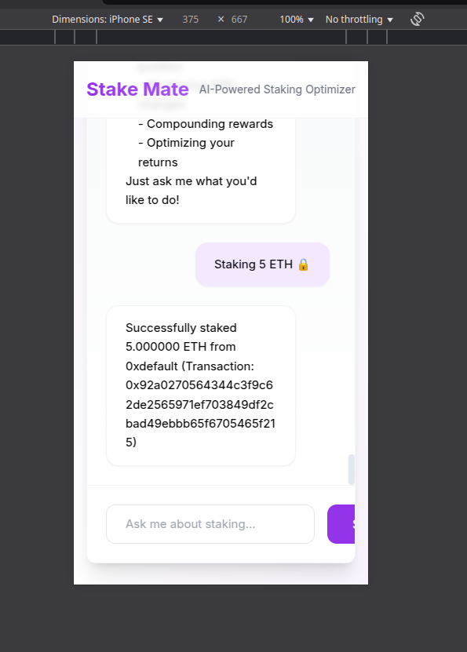

REPO.md
## Issues and Improvements
#### 1. Missing Test Script in `package.json`

The `package.json` file does not include a test script. A test script should be added for better testing automation.

#### 2. Mobile UI Issues
The application does not display well on mobile devices. The UI should be improved for better mobile responsiveness. The "Send" button cannot be seen in mobile view



#### 3. Setup Instructions Need More Detail

The setup instructions need additional clarification. Specifically, users should be instructed to export the environment variables from `sample.env` before running the application.


#### 4. Error Handling in `parser.py`

* ####  Line 299:
  ```
  response = llm_with_tools.invoke(messages)
  ```
  If the `response` fails due to insufficient credits in the OpenRouter API key, it should be wrapped in a try-except block to return an appropriate error message.

### Important issue! 
* #### Line 308:
  Currently, the program returns the same help message every time something goes wrong. However, the LLM often provides useful help messages, which are being ignored. Instead of using.
  ```
  return InformationalCommand(topic="help")
  ```
  The system should return the LLM's response when appropriate. (use the `response.content` for this).

#### 5. Missing Functionality: "Optimizing Your Returns"

The help response lists "Optimizing your returns" as an available feature, but there is no corresponding implementation in the code. This should either be added or removed from the help message. (Gas optimization can also be linked to this)

#### 6. Improving Security in `chat.py` (Line 89)

* Here we check if there is a malicious request in the input, but we can extend this in the following way

```
if any(char in message for char in ["|", "&&", ";", "$(", "`", ">", "<", ">>", "<<", "&>", "2>", "1>", "*", "?"]):
```
```
 unsafe_keywords = [
        "sudo", "rm", "delete", "remove", "drop", "truncate", "shutdown", "halt", "poweroff",
        "kill", "format", "mkfs", "dd", "chmod", "chown", "mv", "cp", "wget", "curl", "scp", "sftp",
        "exec", "system", "subprocess", "eval", "os.system", "shutil", "rf", "overwrite",
        "crontab", "at", "nohup", "setsid", "disown", "service", "init", "reboot",
        "userdel", "groupdel", "passwd", "iptables", "ufw", "firewall", "netstat", "ss",
        "tcpdump", "nmap", "hping3", "strace", "lsof", "pkill", "killall", "bg", "fg",
        "alias", "unalias", "export", "unset", "echo$", "cat/etc/passwd", "cat/etc/shadow"
    ]
```
There is still room for improvement in security to ensure that the user experience is not ruined and is even safer.

#### 7. Docker File Correction
The current command in the Docker file:
```
uvicorn staking_optimizer.api.main:app --host 0.0.0.0 --port 8000
```
Should be updated to:
```
source .venv/bin/activate

set -a && source sample.env && set +a 

uvicorn staking_optimizer.api.main:app --reload
```
And you also need to add the frontend part for the docker.

#### 8. Auto-Scroll Issue in Chat Interface

When sending a message, the user has to manually scroll down to see the response. The chat should automatically scroll to the latest message.

## Testing Results & Fixes Needed

Test Results Summary
* With insufficient credits on the API key: 34 failed, 130 passed, 43 warnings
* With sufficient credits on the API key: 15 failed, 149 passed, 43 warnings

Many of the failing tests are not actual issues.

#### 1.  Long Message Input Issue
* The system allows users to send messages longer than 1000 characters. This should be handled with an appropriate error message, as users are unlikely to send such long messages.

#### 2. Unstaking ETH Not Supported
* The program currently does not support unstaking ETH. This feature should be implemented.

#### 3. No Transaction Data Persistence
* Transactions are not being saved in a database. This should be fixed by adding database support.

#### 4. Missing Public Account Keys

* The system should support accounts with public keys, allowing users to track their staking transactions.


## Summary And Important Development Suggestions

#### 1. Use the LLM response to the output.

In the `parser.py` file there is a variable called `response`. This variable contains the LLM response exactly in `response.content`, in some cases this shoud be the output.

#### 2. Database

There are no database its need to be add as a next step.

### Summary it's a really good program but there's still a lot of work to do before it can be used

### Questions

1. I was a little confused about the emojis, I don't see much use for them in the program.
But I know the crypto community likes to joke around, so it could be a good feature, but I wouldn't focus on that at the beginning.

### Code reporter:  Gergely Gere
#### 2025.03.21
